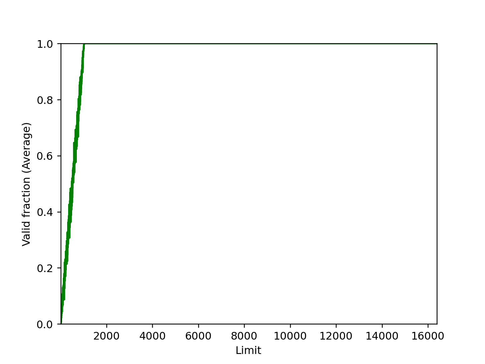

# Chapter 15

## Question 1

python3 relocation.py -s 1

ARG seed 1
ARG address space size 1k
ARG phys mem size 16k

Base-and-Bounds register information:

  Base   : 0x0000363c (decimal 13884)
  Limit  : 290

Virtual Address Trace
  VA  0: 0x0000030e (decimal:  782) --> PA or segmentation violation? Segfault
  VA  1: 0x00000105 (decimal:  261) --> PA or segmentation violation? VA 14145
  VA  2: 0x000001fb (decimal:  507) --> PA or segmentation violation? Segfault
  VA  3: 0x000001cc (decimal:  460) --> PA or segmentation violation? Segfault
  VA  4: 0x0000029b (decimal:  667) --> PA or segmentation violation? Segfault

For each virtual address, either write down the physical address it translates to
OR write down that it is an out-of-bounds address (a segmentation violation). For
this problem, you should assume a simple virtual address space of a given size.

------------------
 python3 relocation.py -s 2 -c

ARG seed 2
ARG address space size 1k
ARG phys mem size 16k

Base-and-Bounds register information:

  Base   : 0x00003ca9 (decimal 15529)
  Limit  : 500

Virtual Address Trace
  VA  0: 0x00000039 (decimal:   57) --> VALID: 0x00003ce2 (decimal: 15586)
  VA  1: 0x00000056 (decimal:   86) --> VALID: 0x00003cff (decimal: 15615)
  VA  2: 0x00000357 (decimal:  855) --> SEGMENTATION VIOLATION
  VA  3: 0x000002f1 (decimal:  753) --> SEGMENTATION VIOLATION
  VA  4: 0x000002ad (decimal:  685) --> SEGMENTATION VIOLATION

------------------

➜  CS5600-memory2 git:(main) ✗ python3 relocation.py -s 3 -c

ARG seed 3
ARG address space size 1k
ARG phys mem size 16k

Base-and-Bounds register information:

  Base   : 0x000022d4 (decimal 8916)
  Limit  : 316

Virtual Address Trace
  VA  0: 0x0000017a (decimal:  378) --> SEGMENTATION VIOLATION
  VA  1: 0x0000026a (decimal:  618) --> SEGMENTATION VIOLATION
  VA  2: 0x00000280 (decimal:  640) --> SEGMENTATION VIOLATION
  VA  3: 0x00000043 (decimal:   67) --> VALID: 0x00002317 (decimal: 8983)
  VA  4: 0x0000000d (decimal:   13) --> VALID: 0x000022e1 (decimal: 8929)

## Question 2

Bound has to be 930.

python3 relocation.py -s 0 -n 10 -c -l 930

ARG seed 0
ARG address space size 1k
ARG phys mem size 16k

Base-and-Bounds register information:

  Base   : 0x0000360b (decimal 13835)
  Limit  : 930

Virtual Address Trace
  VA  0: 0x00000308 (decimal:  776) --> VALID: 0x00003913 (decimal: 14611)
  VA  1: 0x000001ae (decimal:  430) --> VALID: 0x000037b9 (decimal: 14265)
  VA  2: 0x00000109 (decimal:  265) --> VALID: 0x00003714 (decimal: 14100)
  VA  3: 0x0000020b (decimal:  523) --> VALID: 0x00003816 (decimal: 14358)
  VA  4: 0x0000019e (decimal:  414) --> VALID: 0x000037a9 (decimal: 14249)
  VA  5: 0x00000322 (decimal:  802) --> VALID: 0x0000392d (decimal: 14637)
  VA  6: 0x00000136 (decimal:  310) --> VALID: 0x00003741 (decimal: 14145)
  VA  7: 0x000001e8 (decimal:  488) --> VALID: 0x000037f3 (decimal: 14323)
  VA  8: 0x00000255 (decimal:  597) --> VALID: 0x00003860 (decimal: 14432)
  VA  9: 0x000003a1 (decimal:  929) --> VALID: 0x000039ac (decimal: 14764)

## Question 3

Maximum base can be 16284.
## Question 4

 python3 relocation.py -s 1 -n 10 -c -a 9k -p 1m

ARG seed 1
ARG address space size 9k
ARG phys mem size 1m

Base-and-Bounds register information:

  Base   : 0x000d8f16 (decimal 888598)
  Limit  : 2613

Virtual Address Trace
  VA  0: 0x00001b7e (decimal: 7038) --> SEGMENTATION VIOLATION
  VA  1: 0x0000092e (decimal: 2350) --> VALID: 0x000d9844 (decimal: 890948)
  VA  2: 0x000011d5 (decimal: 4565) --> SEGMENTATION VIOLATION
  VA  3: 0x0000102e (decimal: 4142) --> SEGMENTATION VIOLATION
  VA  4: 0x00001775 (decimal: 6005) --> SEGMENTATION VIOLATION
  VA  5: 0x00001c64 (decimal: 7268) --> SEGMENTATION VIOLATION
  VA  6: 0x00000361 (decimal:  865) --> VALID: 0x000d9277 (decimal: 889463)
  VA  7: 0x00000105 (decimal:  261) --> VALID: 0x000d901b (decimal: 888859)
  VA  8: 0x00001e16 (decimal: 7702) --> SEGMENTATION VIOLATION
  VA  9: 0x00000f94 (decimal: 3988) --> SEGMENTATION VIOLATION

## Question 5

# Chapter 16

## Question 1

python3 segmentation.py -a 128 -p 512 -b 0 -l 20 -B 512 -L 20 -s 0 -c    
ARG seed 0
ARG address space size 128
ARG phys mem size 512

Segment register information:

  Segment 0 base  (grows positive) : 0x00000000 (decimal 0)
  Segment 0 limit                  : 20

  Segment 1 base  (grows negative) : 0x00000200 (decimal 512)
  Segment 1 limit                  : 20

Virtual Address Trace
  VA  0: 0x0000006c (decimal:  108) --> VALID in SEG1: 0x000001ec (decimal:  492)
  VA  1: 0x00000061 (decimal:   97) --> SEGMENTATION VIOLATION (SEG1)
  VA  2: 0x00000035 (decimal:   53) --> SEGMENTATION VIOLATION (SEG0)
  VA  3: 0x00000021 (decimal:   33) --> SEGMENTATION VIOLATION (SEG0)
  VA  4: 0x00000041 (decimal:   65) --> SEGMENTATION VIOLATION (SEG1)

python3 segmentation.py -a 128 -p 512 -b 0 -l 20 -B 512 -L 20 -s 1 -c
ARG seed 1
ARG address space size 128
ARG phys mem size 512

Segment register information:

  Segment 0 base  (grows positive) : 0x00000000 (decimal 0)
  Segment 0 limit                  : 20

  Segment 1 base  (grows negative) : 0x00000200 (decimal 512)
  Segment 1 limit                  : 20

Virtual Address Trace
  VA  0: 0x00000011 (decimal:   17) --> VALID in SEG0: 0x00000011 (decimal:   17)
  VA  1: 0x0000006c (decimal:  108) --> VALID in SEG1: 0x000001ec (decimal:  492)
  VA  2: 0x00000061 (decimal:   97) --> SEGMENTATION VIOLATION (SEG1)
  VA  3: 0x00000020 (decimal:   32) --> SEGMENTATION VIOLATION (SEG0)
  VA  4: 0x0000003f (decimal:   63) --> SEGMENTATION VIOLATION (SEG0)

➜  CS5600-memory2 git:(main) ✗ python3 segmentation.py -a 128 -p 512 -b 0 -l 20 -B 512 -L 20 -s 2 -c
ARG seed 2
ARG address space size 128
ARG phys mem size 512

Segment register information:

  Segment 0 base  (grows positive) : 0x00000000 (decimal 0)
  Segment 0 limit                  : 20

  Segment 1 base  (grows negative) : 0x00000200 (decimal 512)
  Segment 1 limit                  : 20

Virtual Address Trace
  VA  0: 0x0000007a (decimal:  122) --> VALID in SEG1: 0x000001fa (decimal:  506)
  VA  1: 0x00000079 (decimal:  121) --> VALID in SEG1: 0x000001f9 (decimal:  505)
  VA  2: 0x00000007 (decimal:    7) --> VALID in SEG0: 0x00000007 (decimal:    7)
  VA  3: 0x0000000a (decimal:   10) --> VALID in SEG0: 0x0000000a (decimal:   10)
  VA  4: 0x0000006a (decimal:  106) --> SEGMENTATION VIOLATION (SEG1)

## Question 2

ARG seed 2
ARG address space size 128
ARG phys mem size 512

Segment register information:

  Segment 0 base  (grows positive) : 0x00000000 (decimal 0)
  Segment 0 limit                  : 20

  Segment 1 base  (grows negative) : 0x00000200 (decimal 512)
  Segment 1 limit                  : 20

highest legal virtual address in segment 0: 19

lowest legal virtual address in segment 1: 108

The lowest illegal physical address: 20

The highest illegal physical address: 491

python3 segmentation.py -a 128 -p 512 -b 0 -l 20 -B 512 -L 20 -s 1 -A 19,108,20,107 -c

## Question 3

 python3 segmentation.py -a 16 -p 128 -c \
      -A 0,1,2,3,4,5,6,7,8,9,10,11,12,13,14,15 \
      --b0 0 --l0 2 --b1 16 --l1 2

## Question 4

python3 segmentation.py -a 16 -p 128 -c \
      -A 0,1,2,3,4,5,6,7,8,9,10,11,12,13,14,15 \
      --b0 0 --l0 1 --b1 16 --l1 1
ARG seed 0
ARG address space size 16
ARG phys mem size 128

Segment register information:

  Segment 0 base  (grows positive) : 0x00000000 (decimal 0)
  Segment 0 limit                  : 1

  Segment 1 base  (grows negative) : 0x00000010 (decimal 16)
  Segment 1 limit                  : 1

Virtual Address Trace
  VA  0: 0x00000000 (decimal:    0) --> VALID in SEG0: 0x00000000 (decimal:    0)
  VA  1: 0x00000001 (decimal:    1) --> SEGMENTATION VIOLATION (SEG0)
  VA  2: 0x00000002 (decimal:    2) --> SEGMENTATION VIOLATION (SEG0)
  VA  3: 0x00000003 (decimal:    3) --> SEGMENTATION VIOLATION (SEG0)
  VA  4: 0x00000004 (decimal:    4) --> SEGMENTATION VIOLATION (SEG0)
  VA  5: 0x00000005 (decimal:    5) --> SEGMENTATION VIOLATION (SEG0)
  VA  6: 0x00000006 (decimal:    6) --> SEGMENTATION VIOLATION (SEG0)
  VA  7: 0x00000007 (decimal:    7) --> SEGMENTATION VIOLATION (SEG0)
  VA  8: 0x00000008 (decimal:    8) --> SEGMENTATION VIOLATION (SEG1)
  VA  9: 0x00000009 (decimal:    9) --> SEGMENTATION VIOLATION (SEG1)
  VA 10: 0x0000000a (decimal:   10) --> SEGMENTATION VIOLATION (SEG1)
  VA 11: 0x0000000b (decimal:   11) --> SEGMENTATION VIOLATION (SEG1)
  VA 12: 0x0000000c (decimal:   12) --> SEGMENTATION VIOLATION (SEG1)
  VA 13: 0x0000000d (decimal:   13) --> SEGMENTATION VIOLATION (SEG1)
  VA 14: 0x0000000e (decimal:   14) --> SEGMENTATION VIOLATION (SEG1)
  VA 15: 0x0000000f (decimal:   15) --> VALID in SEG1: 0x0000000f (decimal:   15)

Limit parameters are important.

## Question 5

python3 segmentation.py -a 16 -p 128 -c \
      -A 0,1,2,3,4,5,6,7,8,9,10,11,12,13,14,15 \
      --b0 0 --l0 0 --b1 16 --l1 0

# Chapter 17

## Question 1
Memory is more fragmented overtime. Free memories are not merged.

python3 malloc.py -n 10 -H 0 -p BEST -s 0 -c
seed 0
size 100
baseAddr 1000
headerSize 0
alignment -1
policy BEST
listOrder ADDRSORT
coalesce False
numOps 10
range 10
percentAlloc 50
allocList 
compute True

ptr[0] = Alloc(3) returned 1000 (searched 1 elements)
Free List [ Size 1 ]: [ addr:1003 sz:97 ]

Free(ptr[0])
returned 0
Free List [ Size 2 ]: [ addr:1000 sz:3 ][ addr:1003 sz:97 ]

ptr[1] = Alloc(5) returned 1003 (searched 2 elements)
Free List [ Size 2 ]: [ addr:1000 sz:3 ][ addr:1008 sz:92 ]

Free(ptr[1])
returned 0
Free List [ Size 3 ]: [ addr:1000 sz:3 ][ addr:1003 sz:5 ][ addr:1008 sz:92 ]

ptr[2] = Alloc(8) returned 1008 (searched 3 elements)
Free List [ Size 3 ]: [ addr:1000 sz:3 ][ addr:1003 sz:5 ][ addr:1016 sz:84 ]

Free(ptr[2])
returned 0
Free List [ Size 4 ]: [ addr:1000 sz:3 ][ addr:1003 sz:5 ][ addr:1008 sz:8 ][ addr:1016 sz:84 ]

ptr[3] = Alloc(8) returned 1008 (searched 4 elements)
Free List [ Size 3 ]: [ addr:1000 sz:3 ][ addr:1003 sz:5 ][ addr:1016 sz:84 ]

Free(ptr[3])
returned 0
Free List [ Size 4 ]: [ addr:1000 sz:3 ][ addr:1003 sz:5 ][ addr:1008 sz:8 ][ addr:1016 sz:84 ]

ptr[4] = Alloc(2) returned 1000 (searched 4 elements)
Free List [ Size 4 ]: [ addr:1002 sz:1 ][ addr:1003 sz:5 ][ addr:1008 sz:8 ][ addr:1016 sz:84 ]

ptr[5] = Alloc(7) returned 1008 (searched 4 elements)
Free List [ Size 4 ]: [ addr:1002 sz:1 ][ addr:1003 sz:5 ][ addr:1015 sz:1 ][ addr:1016 sz:84 ]
## Question 2
With WORST fit policy, less searches are performed but memories are more fragmented than before.

## Question 3
Search speeds up with first fit.

## Question 4
SIZESORT- is best for  FIRST fit policy in terms of searches. But the memories are more fragmented.

List orderings does not have any effect for BEST or WORST fit policy.

## Question 5
With coalescing, memories are less fragmented there for searching for free space takes less time. Ordering list plays an important role here.

## Question 6
With percent allocated fraction nears 100, lots of alloactions are failed because there  are less memory being freed.

## Question 7

Not coalescing free list generates highly fragmented free list. 

python3 malloc.py -c -A +10,-0,+20,-1,+30,-2,+40,-3 -p FIRST

python3 malloc.py -c -A +10,-0,+20,-1,+30,-2,+40,-3 -p FIRST -l SIZESORT-